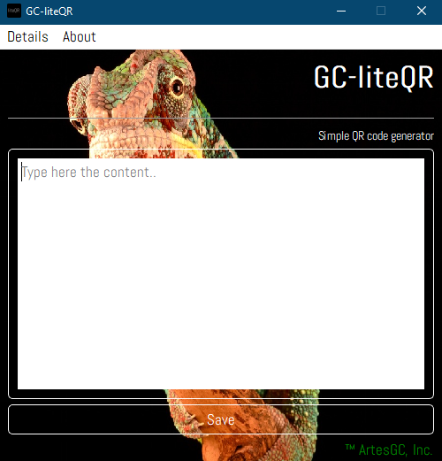

# 

GC-liteQR is a simple and practical QR codes generator
it was built with `PyQt6 + QSS + PyQRCode` frameworks allowing the user
to easily create QR codes with three simple steps:

1. Type de content on the text box;
2. Create the file clicking the button;
3. Giving a name to the file and confirming the action;

The program saves the file as PNG file and also customizes it
with different colors (automatically) each time you try to create a new one.

## Demos

`main-page`

`QR example`

---

&copy; 2022 Nurul-GC |
[Free License](./LICENSE-EN) |
&trade; ArtesGC, Inc. 

